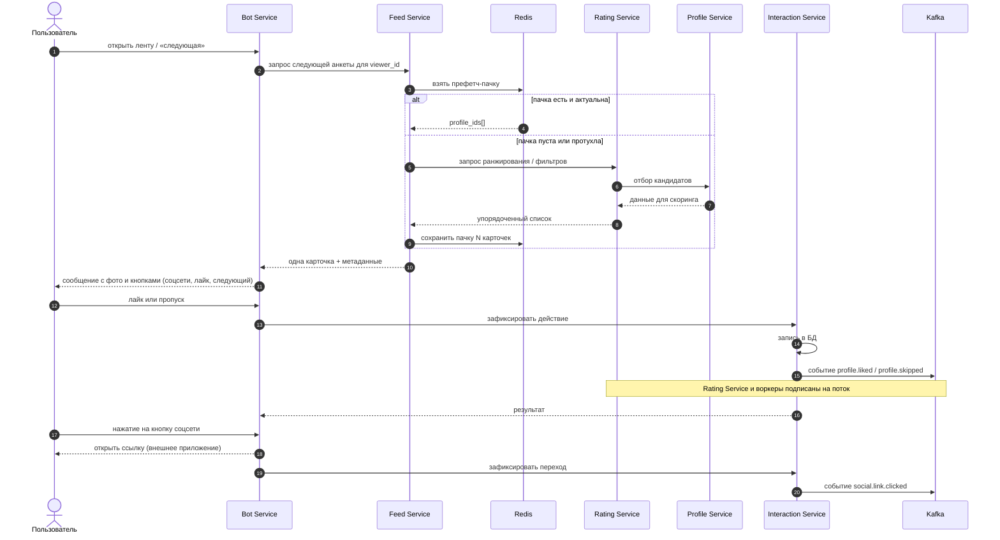

# Лента анкет и лайки

Как пользователь получает карточки и какие записи и события появляются при действиях. Акцент на связке **Feed + Redis + Interaction + Kafka**, как в архитектурном описании.

**Идея кэша**

- Первая карточка может считаться «в лоб», следующие — из **предзагруженной** очереди в Redis, чтобы не блокировать чат на тяжёлом ранжировании при каждом свайпе.
- При изменении рейтинга пачка может инвалидироваться по TTL или по событию пересчёта — детали политики кэша остаются на этапе реализации.

**Топ художников**

- Команда `/top` запрашивает топ-10 из Redis.
- Кэш обновляется каждые 5 минут через Celery-задачу.
- Каждая карточка топа содержит кнопки соцсетей.
