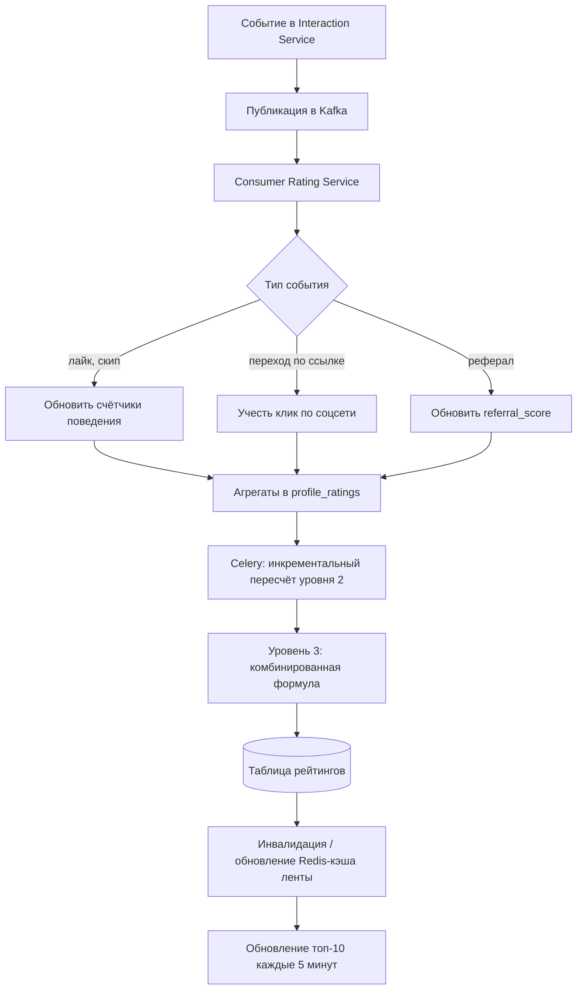

# Пайплайн событий и рейтинга

Обобщённый поток: **действие пользователя → событие → агрегация → уровни рейтинга → обновление выдачи**. Это дополняет текстовый раздел про Celery и Kafka в `ARCHITECTURE.md`.

**Уровни (напоминание)**

1. **Первичный** — в основном из данных анкеты и полноты; обновляется при существенных правках профиля.
2. **Поведенческий** — из стриминга событий и агрегатов (лайки, переходы, временные паттерны). Инкрементальное обновление при каждом событии.
3. **Комбинированный** — периодически сводит 1 и 2 (40% + 60%) и добавляет реферальный бонус. Полный пересчёт раз в час через Celery.

**События в Kafka**

| Событие | Описание | Влияние на рейтинг |
|---------|----------|-------------------|
| `profile.liked` | Пользователь лайкнул анкету **для общения** | + к behaviour_rating |
| `profile.favorited` | Пользователь лайкнул анкету **в избранное** | + к behaviour_rating |
| `profile.skipped` | Пользователь пропустил анкету | - к behaviour_rating |
| `social.link.clicked` | Переход по ссылке на соцсеть | + к behaviour_rating |
| `match.created` | Образовался мэтч (взаимный лайк для общения) | + бонус к behaviour_rating |
| `referral.registered` | Зарегистрировался реферал | + к referral_score |

На диаграмме не показаны отдельные топики Kafka — достаточно договориться об именах событий и идемпотентности обработчиков.
