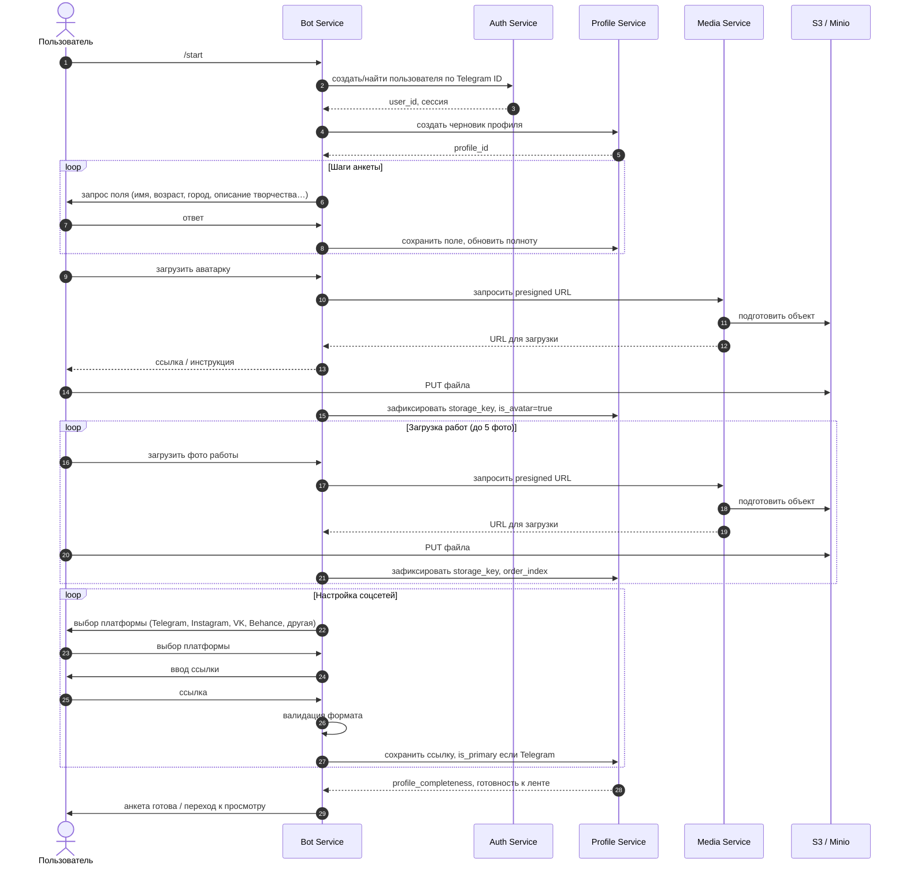

# Регистрация и заполнение анкеты

Последовательность от первого контакта с ботом до состояния «анкета заполнена, можно показывать в ленте». Имена сообщений и шагов ориентированы на сценарии из корневого README.

**Замечания по данным**

- После появления осмысленных полей анкеты сервис рейтингов может рассчитать **первичный** вклад (уровень 1); на диаграмме это не размазано по отдельным вызовам — на практике это отдельный запрос или событие `profile.updated` в очередь.
- Повторные правки анкеты повторяют цикл «запрос поля → Prof», без обязательного прохода через Auth.
- Telegram как основная соцсеть даёт бонус к первичному рейтингу.
- Можно добавлять несколько соцсетей — каждая отображается отдельной кнопкой в карточке.
